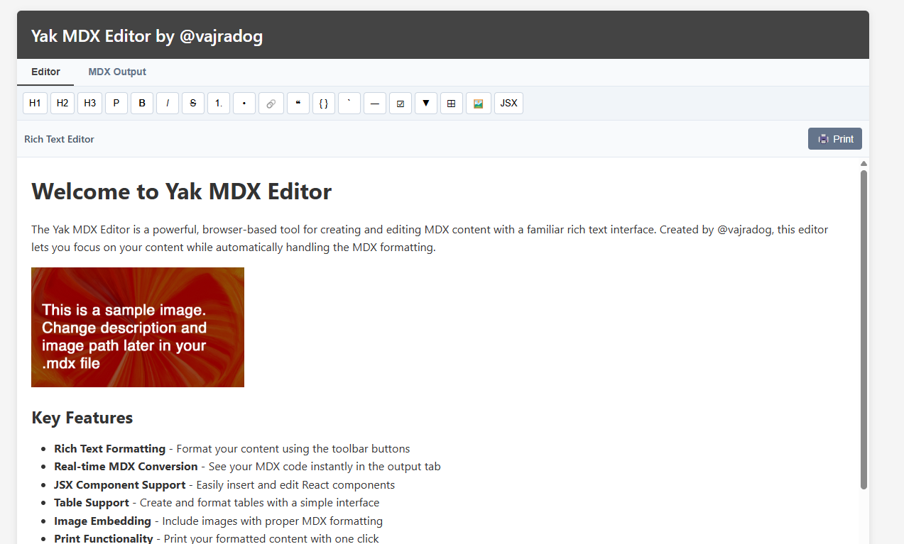

# Yak MDX Editor

A lightweight, browser-based WYSIWYG editor for creating MDX content with real-time preview.

**Live Demo**: [https://vajradog.github.io/YAKmdxeditor/](https://vajradog.github.io/YAKmdxeditor/)



## Features

- **Rich Text Editing**: Format your content using a familiar interface
- **Real-time MDX Conversion**: Instantly see how your content converts to MDX
- **JSX Component Support**: Easily insert and edit React components
- **No Dependencies**: Works entirely in the browser with no external requirements
- **Print Functionality**: Print your formatted content directly from the editor
- **Copy to Clipboard**: One-click copying of generated MDX

## Formatting Options

| Button | Function | MDX Output |
|--------|----------|------------|
| H1, H2, H3 | Heading levels | `# Heading`, `## Heading`, etc. |
| B, I, S | Bold, Italic, Strikethrough | `**bold**`, `*italic*`, `~~strikethrough~~` |
| 1., • | Ordered and unordered lists | `1. item`, `- item` |
| 🔗 | Insert link | `[text](url)` |
| ❝ | Blockquote | `> quoted text` |
| { } | Code block | ``` ```code``` ``` |
| ` | Inline code | `` `code` `` |
| ― | Horizontal rule | `---` |
| ☑ | Task list | `- [ ] Task` |
| ▼ | Expandable section | `<details><summary>...</summary>...</details>` |
| ⊞ | Insert table | `\| Header \| Header \|\n\| --- \| --- \|` |
| 🖼️ | Insert image | `` |
| JSX | Insert JSX component | `<Component prop="value" />` |

## Usage

1. Visit the [live demo](https://vajradog.github.io/YAKmdxeditor/) or download and open `index.html` in your browser
2. Use the toolbar to format your content
3. Click "MDX Output" tab to view the generated MDX
4. Use the "Copy MDX" button to copy the code to your clipboard
5. Use the "Print" button in the editor to print your formatted content

## Installation

The Yak MDX Editor is completely self-contained and doesn't require any build process or dependencies.

### Option 1: Use the hosted version

Simply visit [https://vajradog.github.io/YAKmdxeditor/](https://vajradog.github.io/YAKmdxeditor/) to use the editor online.

### Option 2: Host it yourself

1. Clone this repository:
   ```
   git clone https://github.com/vajradog/YAKmdxeditor.git
   ```

2. Open `index.html` in your browser or upload to any web hosting service

### Option 3: Standalone file

1. Download the `index.html` file
2. Place it in a folder along with any images you want to include
3. Open in any modern browser

## How It Works

The Yak MDX Editor uses pure JavaScript to create a WYSIWYG editing experience that automatically converts to MDX format. It leverages the browser's native `contentEditable` functionality and systematically transforms HTML elements to their MDX equivalents.

## Contributing

Contributions are welcome! Feel free to open issues or submit pull requests to help improve the Yak MDX Editor.

## License

MIT License

## Author

Created by [@vajradog](https://github.com/vajradog)